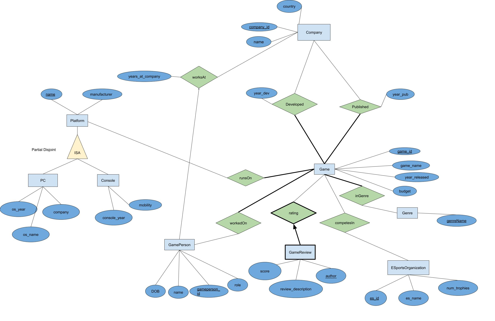

## Summary of the Project

The domain of the project is the video game industry. 
This application aims to describe the comprehensive database for game 
enthusiasts, researchers, and industry professionals to easily access 
and analyze data related to video game development, publishing, 
and distribution. Users will be able to find information about 
various games including developer and publisher, genre, platforms 
the game runs on, and people involved with the games. Users will be
able to add information, update entries, and delete entries using a GUI. 

## ERD

## Milestone 1
[Milestone 1 PDF](./assets/CPSC304%20Milestone%201%20Group%2014.pdf)

## Milestone 2
[Milestone 2 PDF](./assets/CPSC304_Milestone2_Group14.pdf)

## Milestone 3
[Milestone 3 PDF](./assets/CPSC304_Milestone3_Group14.pdf)
